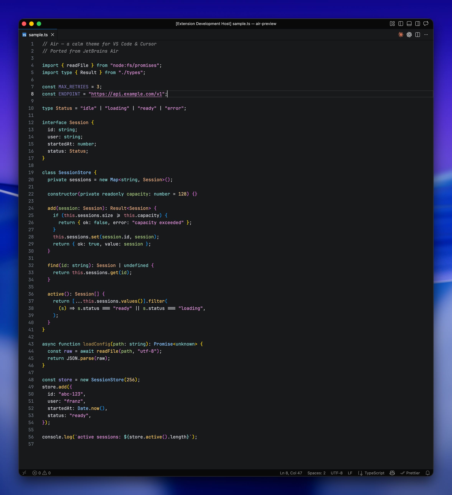

# Air

A VS Code + Cursor port of JetBrains Air — a calm theme family with lavender keywords, pink strings, amber numbers, and green function params.




## Features

- **Air dark** — near-black `#18191B` editor, soft pastel syntax
- **Air light** — near-white `#FBFBFC` editor, deep-tone syntax
- **Air dark italic** / **Air light italic** — bold functions with italic strings and parameters
- Matched UI chrome, git decorations, diff colors, and terminal ANSI palette
- Semantic highlighting tuned for JavaScript, TypeScript, Python, Rust, Go, Java, C/C++, PHP, and Ruby

## Install

### VS Code

1. Extensions panel (`Cmd+Shift+X` / `Ctrl+Shift+X`)
2. Search `Air` by `franzgollhammer`
3. Install
4. `Cmd+K Cmd+T` → choose an **Air dark**, **Air light**, or italic variant

Or via CLI:

```sh
code --install-extension franzgollhammer.air-theme
```

### Cursor

Cursor pulls extensions from Open VSX. Same flow: open the Extensions panel, search `Air`, install, then pick it under `Color Theme`.

```sh
cursor --install-extension franzgollhammer.air-theme
```

### Manual (`.vsix`)

Download the latest `.vsix` from [Releases](https://github.com/franzgollhammer/air-theme-vscode/releases), then:

```sh
code --install-extension air-theme-<version>.vsix
# or
cursor --install-extension air-theme-<version>.vsix
```

## Palette

### Air dark

| Color       | Role                                                           |
| ----------- | -------------------------------------------------------------- |
| `#D6D6DD`   | Default fg — variables, punctuation, identifiers               |
| `#A8CC7C`   | Function params (at declaration)                               |
| `#82D2CE`   | Storage/keywords, types, booleans, markdown list markers       |
| `#AAA0FA`   | `const`/`let` declarations, imports, markdown headings         |
| `#E5C995`   | Functions, invocations                                         |
| `#AC9DF8`   | Constants                                                      |
| `#F8C762`   | Bold markdown                                                  |
| `#EFB080`   | Classes, type names, namespaces                                |
| `#E394DC`   | Strings, markdown link parens                                  |
| `#87C3FF`   | CSS properties, support classes                                |
| `#EBC88D`   | Numbers                                                        |
| `#CC7C8A`   | `this` / `self`                                                |

Editor background: `#18191B`.

### Air light

| Color       | Role                                                           |
| ----------- | -------------------------------------------------------------- |
| `#1F2024`   | Default fg                                                     |
| `#62661E`   | Function params                                                |
| `#2F626C`   | Keywords, markdown headings                                    |
| `#1F7F78`   | Storage, types, booleans                                       |
| `#5A4ECF`   | Declarations, imports                                          |
| `#4D18B8`   | Functions, invocations                                         |
| `#962B89`   | Constants, numbers                                             |
| `#A85A29`   | Classes, type names, namespaces                                |
| `#306C24`   | Strings, markdown link parens                                  |
| `#0E5FA8`   | CSS properties, support classes                                |
| `#84527D`   | `this` / `self`                                                |

Editor background: `#FBFBFC`.

## Terminal themes

Matching palettes for Ghostty, iTerm2, and Warp live in [`terminal-themes/`](terminal-themes).

### Ghostty

Copy theme file into Ghostty's themes dir, then reference it in config:

```sh
mkdir -p ~/.config/ghostty/themes
cp terminal-themes/ghostty/air-dark ~/.config/ghostty/themes/
cp terminal-themes/ghostty/air-light ~/.config/ghostty/themes/
```

In `~/.config/ghostty/config`:

```
theme = air-dark
# or: theme = air-light
# or split: theme = light:air-light,dark:air-dark
```

Reload: `Cmd+Shift+,` (macOS) or restart Ghostty.

### iTerm2

1. iTerm2 → Settings → Profiles → Colors
2. **Color Presets…** → **Import…**
3. Pick `terminal-themes/iterm2/air-dark.itermcolors` (and/or `air-light.itermcolors`)
4. **Color Presets…** → select **air-dark** or **air-light**

### Warp

Copy YAML files into Warp's themes dir, then pick from theme picker:

```sh
mkdir -p ~/.warp/themes
cp terminal-themes/warp/air-dark.yaml ~/.warp/themes/
cp terminal-themes/warp/air-light.yaml ~/.warp/themes/
```

Open Warp → `Cmd+P` → **Open Theme Picker** → choose **Air dark** or **Air light**.

## Pair with Air File Icons

> **[Air File Icons](https://marketplace.visualstudio.com/items?itemName=franzgollhammer.air-file-icons)** ([Open VSX](https://open-vsx.org/extension/franzgollhammer/air-file-icons) · [repo](https://github.com/franzgollhammer/air-icons-vscode)) — matching JetBrains Air–inspired file icon theme.

## Development

```sh
npm run dev            # launch VS Code with the extension loaded
npm run dev:insiders   # VS Code Insiders
npm run build:themes   # regenerate light + italic variants
npm run package        # build .vsix
npm run install:local  # package + install into VS Code
```

See [`scripts/`](scripts) for release automation and [`RELEASING.md`](RELEASING.md) for the publish flow.

## Credits

Inspired by [JetBrains Air](https://www.jetbrains.com/).

## License

[MIT](LICENSE.md)
